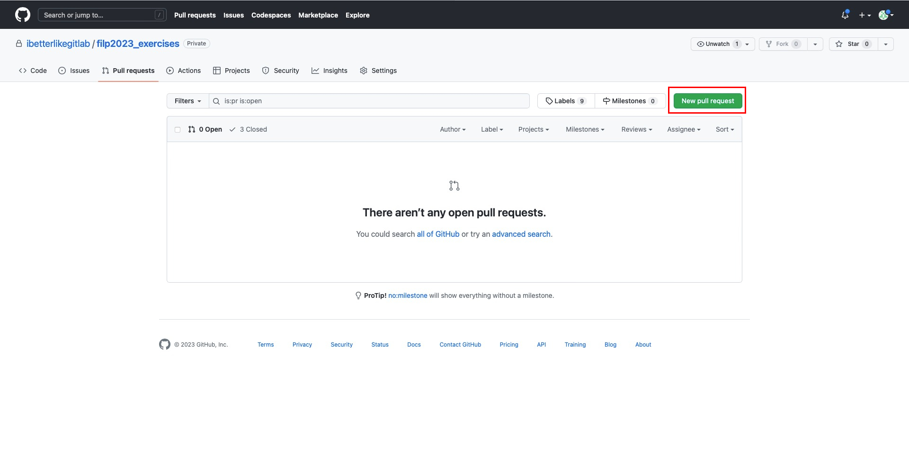

## Выполнения заданий

1. Перейти в ветку для выполнения очередного задания

```bash
git checkout -b exercises01
```

2. После выполнения работы необходимо ее зафиксировать в гите

```bash
git add .
git commit -m "Иванов Иван exercises01"
git push origin exercises01
```

> Вместо "Иванов Иван" должны быть ваши фамилия и имя, а вместо " exercises01" - номер домашки, которую выполнили

2. Далее необходимо создать Pull Request в ветку main вашего репозитория
   3. Перейдите на вкладку Pull Requests вашего репозитория и нажмина на кнопку new Pull Request
   
   4. Поменяйте ветки, чтобы мердж был ***из*** ветки с заданием ***в*** ветку `main`
   
3. Название Pull Request'а должно удовлетворять правилу "<Фамилия> <Имя> exercies<номер задания в две цифры>"
4. Цель выполнения работы - успешное прохождение тестов в github. После этого будет проходить ревью.

> Чтобы преподаватели начали процесс ревью, ***необходимо*** отправить ссылку ваш PR
> в [курс](https://edu.tinkoff.ru/educate/course/b4c5827f-3687-4e7f-8519-81be85d88fbf/overview)

## Получение новых заданий

> Команды ниже надо повторять для каждого обновления

1. Переключаемся на ветку main, т.к. будем обновлять её

```bash
git checkout main
```

2. После этого можно получить изменения

```bash
git pull upstream main
```

3. И отправить их к себе в репозиторий

```bash
git push origin main
```