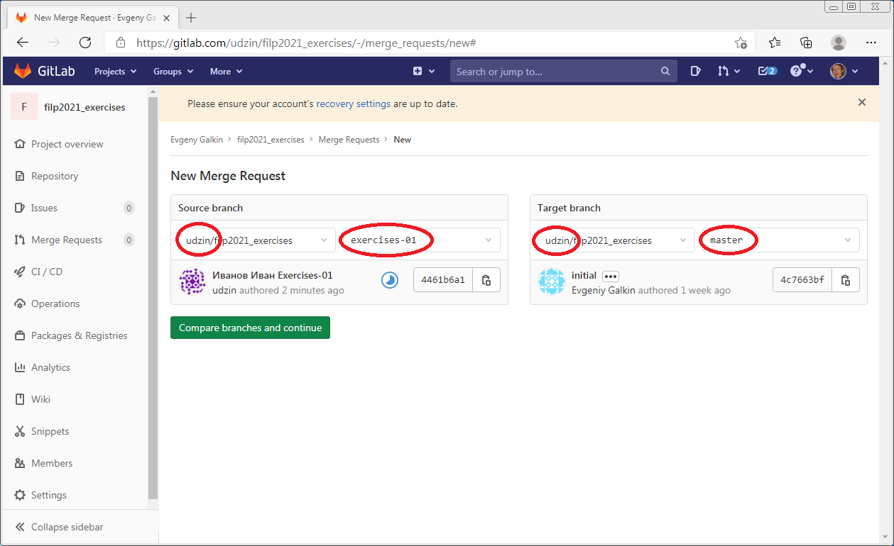
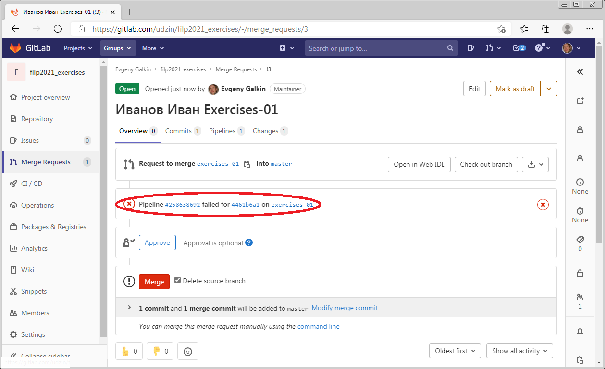
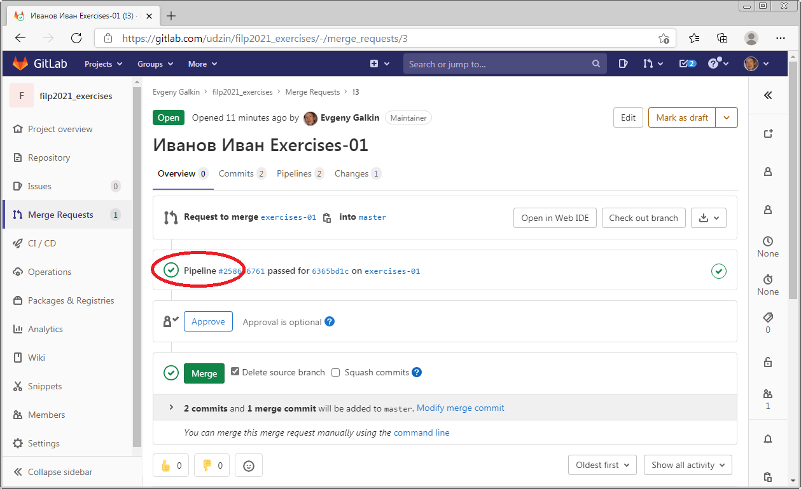

# Выполнение практических работ
Для выполнения практики нужно создать ветку с ее названием.
**Имя ветки должно совпадать с именем модуля (папки) с практикой. На это имя срабатывают тесты в CI и проверяют только эту практику.**
Например для первой работы будет ветка exercises01, для второй exercises02 и т.д.

в интерфейсе в меню Git-New branch

или в терминале

    git checkout -b exercises01

Далее идет работа с кодом, после ее выполнения нужно отправить изменения в гитлаб

в интерфейсе

или в терминале 

    git add .
    git commit -m "Иванов Иван exercises01"
    git push origin exercises01

После этого нужно поставить Merge Request

Обратите внимание, что нужно ставить Target Branch **main** в **ваш** репозиторий

Если тесты не прошли, то возможности смержить ветку с main не будет, так же в интерфейсе можно будет увидеть это

После исправления тестов статус пайплайна поменяется на Success

После того, как все тесты успешно прошли, нужно в описании Merge Request написать **@all** (тегнуть всех), чтобы преподаватели получили уведомление о необходимости проверки работы

**Преподаватель после проверки сам закроет MergeRequest, мерджить его в main не надо**

# Синхронизация с основным репозиторием
Для того чтобы подтягивать в свой репозиторий изменения из основного, его нужно добавить в качестве нового remote. Сделать это нужно **один** раз.

    git remote add upstream https://github.com/filp2023/exercises

### Команды ниже надо повторять для каждого обновления

Переключаемся на ветку main, т.к. будем обновлять её

    git checkout main

После этого можно получить изменения

    git pull upstream main

И отправить их к себе в репозиторий

    git push origin main