# Подготовка к курсу Функциональное и логическое программирование

### Установка Intellij IDEA

1. Скачать и установить Intellij Idea Community edition - [https://www.jetbrains.com/idea/download/](https://www.jetbrains.com/idea/download/)
   1. Альтернативный вариант - воспользоваться Jetbrainds Toolbox [https://www.jetbrains.com/lp/toolbox/](https://www.jetbrains.com/lp/toolbox/)
2. Перейти во вкладку Plugins
3. Далее необходимо установить плагин Scala:
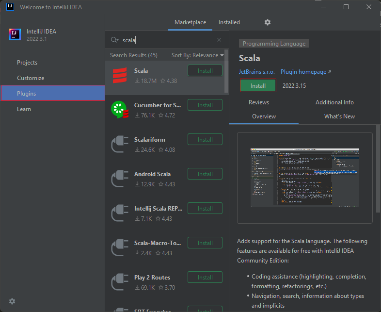

> Альтернативный вариант - VS Code + плагин Metals, но он значительно хуже заточен под работу со Scala, чем Intellij IDEA и в это случае мы вряд ли сможем вам помочь :). Так же вы можете использовать Ultimate edition по студенческой лицензии - подробнее на сайте Jetbrains.

### В уже установленной Intellij IDEA

1. Перейти в Файл > Настройки > Плагины > Установить Scala плагин

### Создание SSH ключа

1. Windows 
   1. Открыть cmd.exe
   2. Ввести команду `ssh-keygen -b 2048 -t rsa`
   3. Если не сработало, то надо установить клиент OpenSSH:
      1. Открыть Настройки > Приложения > Приложения и возможности > Дополнительные компоненты
      2. Нажать сверху "Добавить компонент" и там через поиск установить "Клиент OpenSSH".
   4. Проследовать всем пунктам установки, пароль устанавливать смысла нет, менять путь тоже не стоит
   5. После завершения будет сгенерирована пара файлов - `id_rsa` и `id_rsa.pub`, путь к ним был указан в процессе установки
   6. Необходимо скопировать в буфер обмена содержимое файла `id_rsa.pub`
2. Linux / Macos
   1. Открыть терминал
   2. Аналогично windows, начиная с 3-го шага

### Установка SSH ключа в GitHub

1. Зарегистрироваться на [https://github.com](https://github.com)
2. Перейти на [https://github.com/settings/keys](https://github.com/settings/keys)
3. Нажать на кнопку `New SSH key`
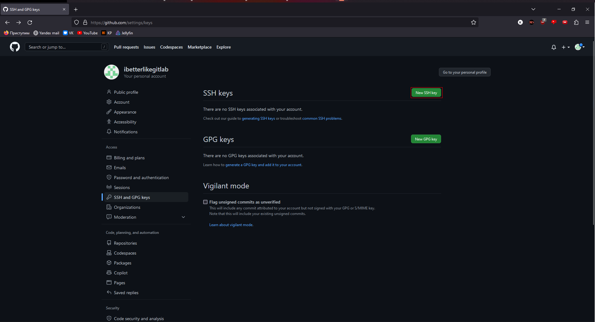
1. Дать удобное вам название, например <имя пользователя>_<операционная система>
2. В поле `Key` вставить содержимое файла `id_rsa.pub`
3. Нажать кнопку `Add SSH key`

> Впредь вы сможете взаимодействовать со своим GitHub аккаунтом по SSH - клонировать, пушить и т.д. без ввода пароля

### Подготовка проекта

1. Создать у себя в профиле пустой приватный репозиторий - [https://github.com/new](https://github.com/new)
   1. Назвать `filp2023_exercises`
   2. Сделать его приватным
   3. Добавлять никаких файлов не надо
   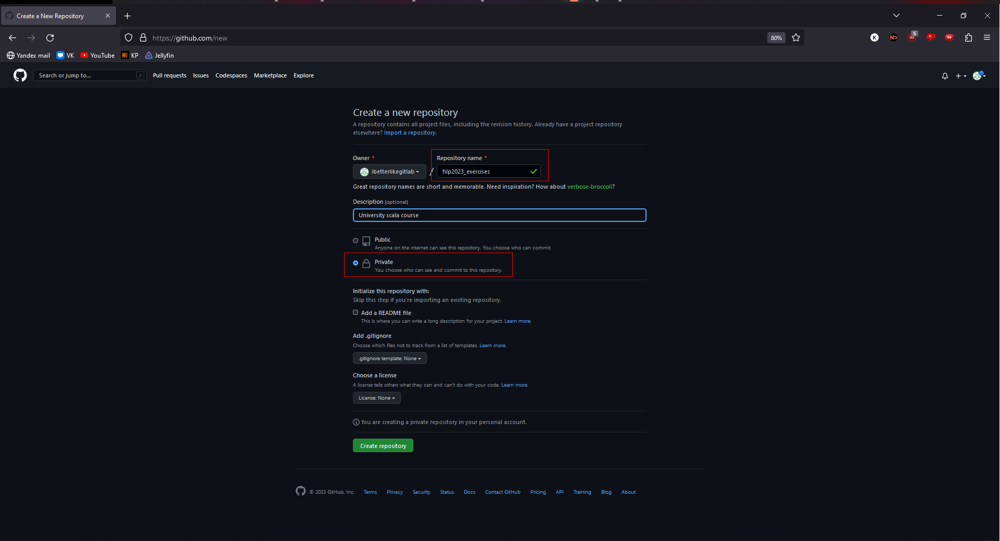
   4. Далее перейти в настройки репозитория, в раздел Collaborators
   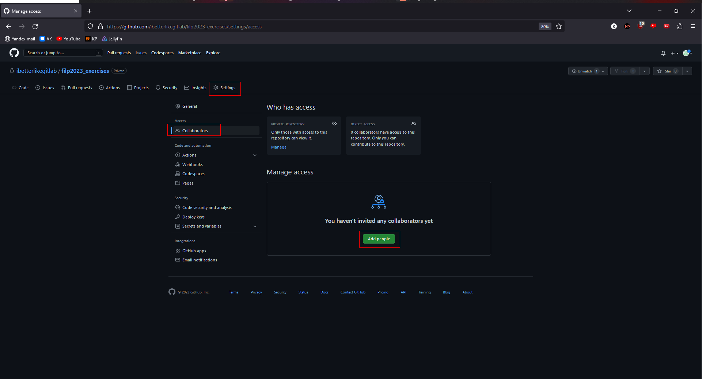
   5. Нажав `Add people`, добавить в свой проект преподавателей из списка:
      * `a-khakimov`
      * `bondach`
      * `Killjoyer`
      * `Ledostuff`
      * `udzin`
      * `ulanzetz`
2. В окне Intellij выбрать Get from VCS
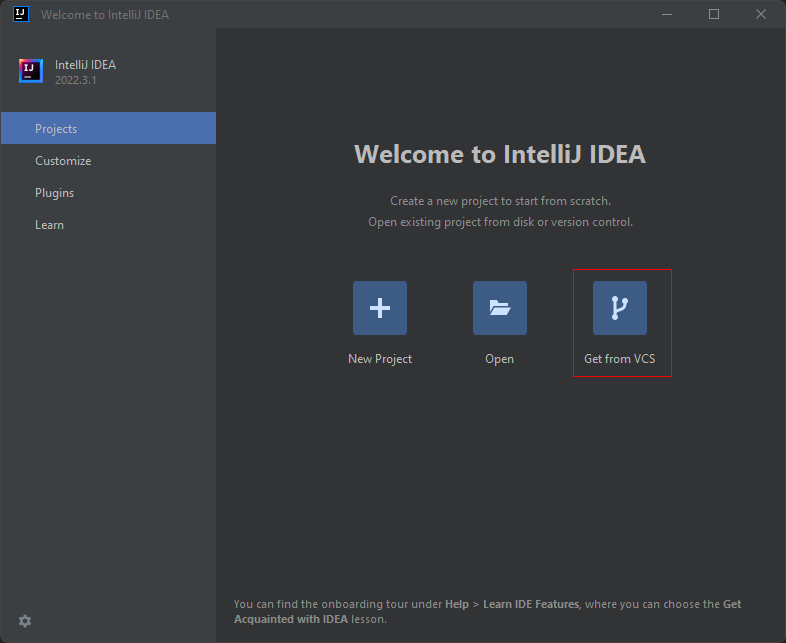
1. В поле `Ссылка` вставить [https://github.com/filp2023/filp2023_exercises](https://github.com/filp2023/filp2023_exercises)  - проект с домашними заданиями
   1. IDEA может написать, что не установлен GIT, тогда следует нажать кнопку `Скачать и установить`
2. Нажать кнопку `Clone`, желательно, чтобы итоговый путь до проекта не содержал русских символов и пробелов
   1. Скорее всего Intellij Idea высветит два предупреждения - `Project JDK not found` и `No scala SDK in module` (Возможно, для этого понадобится открыть какой-нибудь Scala файл)
   
   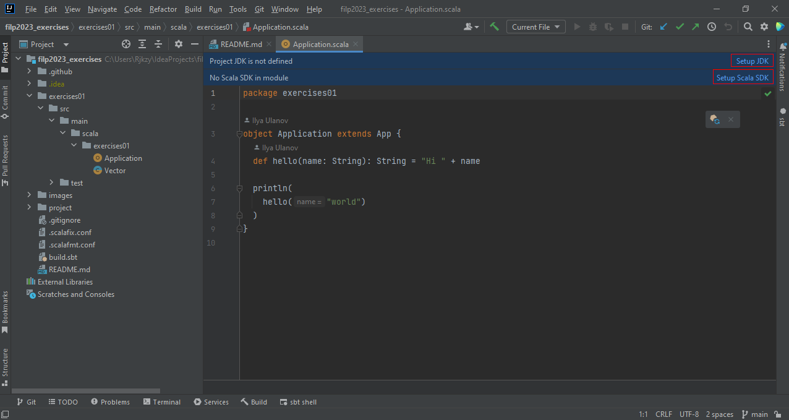
   2. Необходимо нажать на кнопки рядом и установить и то, и другое
   3. Java
      1. Нажать на кнопку Setup JDK
      2. Выбрать Download
      3. выбрать 19 версию Oracle OpenJDK  
      
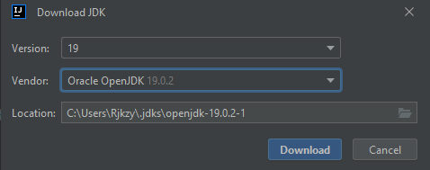
   4. Scala
      1. Нажать на кнопку Setup Scala SDK
      2. Нажать на кнопку Create
      3. Нажать на кнопку Download
      4. Выбрать версию 2.13.10
       
      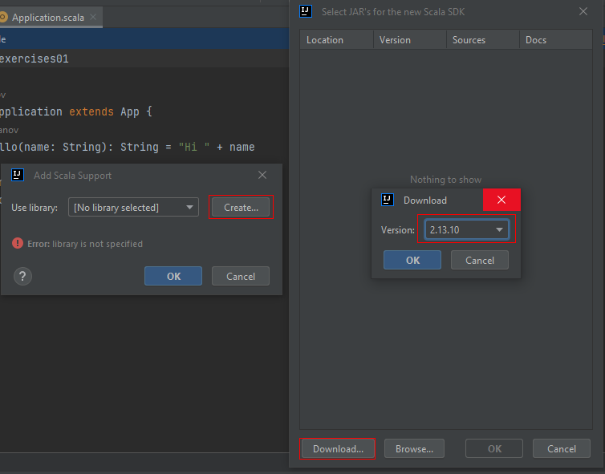
1. Далее необходимо добавить ваш репозиторий в качестве основного, подменив наш.
   1. Windows 
      1. открыть приложение Git CMD
   2. Linux / MacOS
      1. открыть терминал
   3. Перейти в директорию с проектом
   4. ввести следующие команды по очереди:
      1. `git remote rename origin upstream`
      2. `git remote add origin <SSH ссылка на ваш репозиторий>`
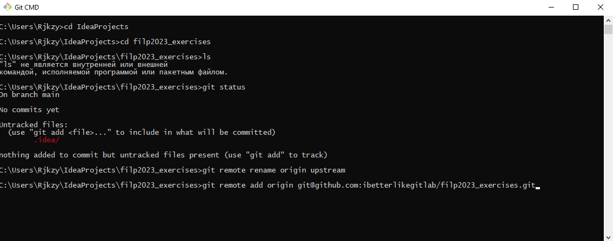
1. Далее необходимо настроить корректную сборку проекта
   1. Переходим в File > Settings
   2. Вбить в поиск sbt
   3. Выбрать меню Build, Execution, Deployment > Build Tools > sbt
   4. Поставить следующие настройки
    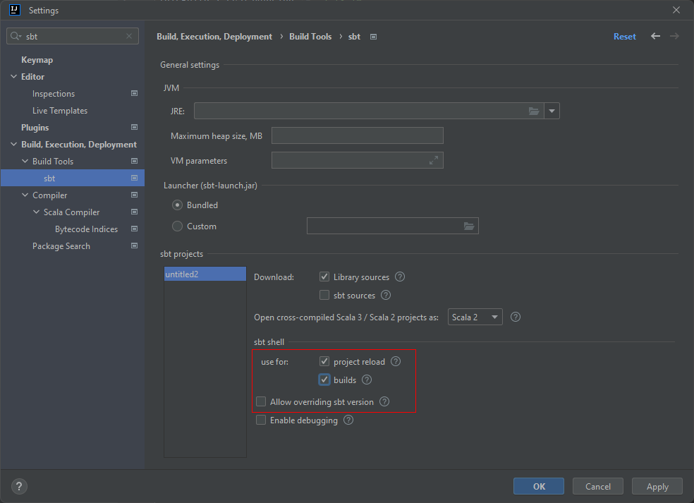
2. Запускаем импорт проекта - нажать на маленькую красную кнопку справа-сверху
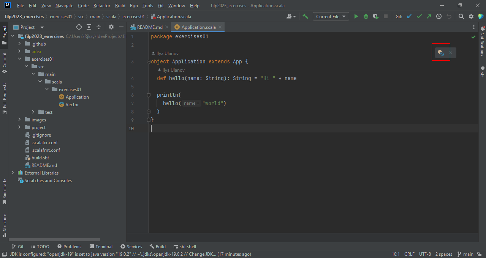
1. Пока проект импортируется, можно переключить форматировщик
    1.  Перейти в File > Settings
    2.  Вбить в поиск `scalafmt`
    3.  Выбрать меню Editor > Code Style > Scala
    4.  Выбрать в качестве форматировщика `Scalafmt`
    
    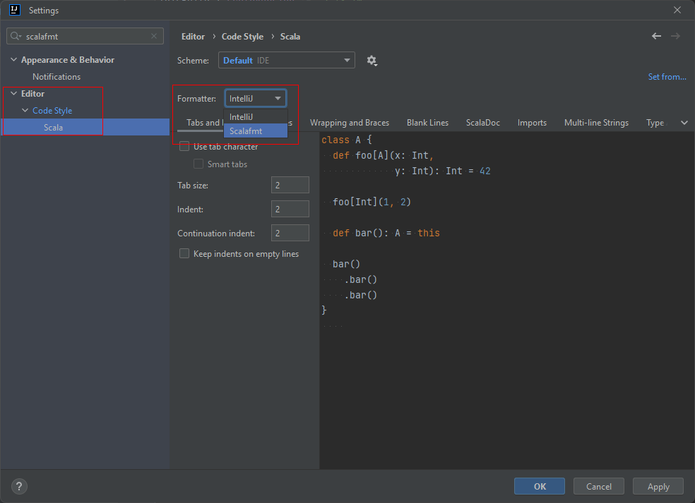
2. ***Далее необходимо сделать `push` в свой пустой репозиторий - `git push origin` в терминале гита или через UI intellij, ничего не изменяя. Так вы добавите актуальную ветку main к себе проект.***

> Обратите на последний шаг внимание - если этого не сделать, то main не будет основной веткой.

### Регистрация на портале образования

1. Зарегистрироваться на [https://edu.tinkoff.ru/](https://edu.tinkoff.ru/);
2. Присоединиться к [курсу](https://edu.tinkoff.ru/educate/course/b4c5827f-3687-4e7f-8519-81be85d88fbf/overview);
3. Когда вы создадите Pull Request на гитхабе, нужно сдать соответствуещее ей задание в этом курсе - просто прикрепите в поле для ответа ссылку на ваш PR. Баллы за задание тоже будут там.
   1. Перейдите на страницу нужной практики
   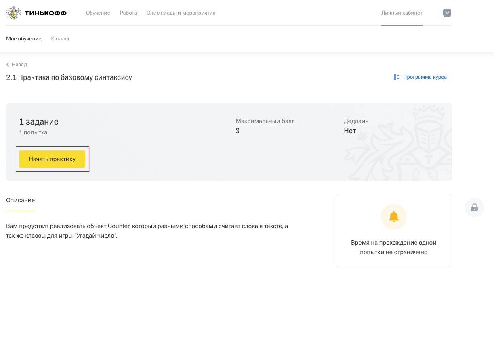
   2. Вставьте в поле "Ответ" ссылку на ваш PR и отправьте работу
   